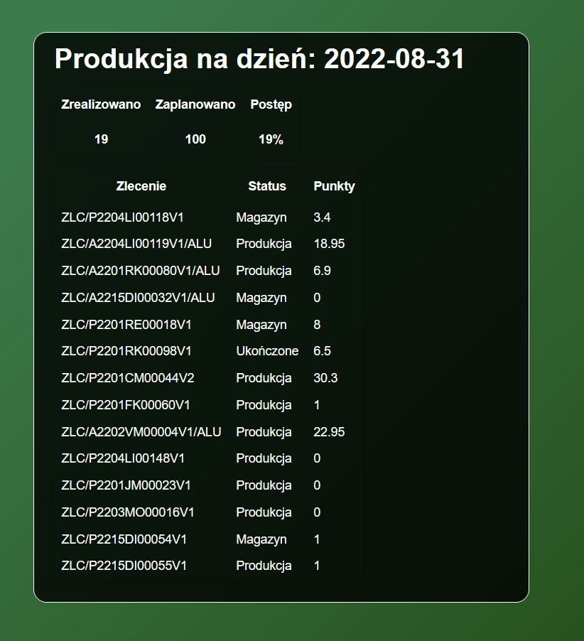

# ProductionPontsCounter

This app shows current orders on the display in the production hall in OknoPlus.

## Table of contents
* [General info](#general-info)
* [Technologies](#technologies)
* [Setup](#setup)

## General info
The first part of the ProductionPontsCounter is a Web API that provides information 
about today's production. It contains a list of orders and production points divided
into completed and to be produced.

The client application is a simple website that can be run on smart tv.
It shows the list and the percentage of production progress.

## Technologies

ASP.NET Core 6.0    
Entity Framework Core 6.0   
HTML+CSS+JavaScript

## Setup

Build the project in Visual Studio and run on the company server, 
open index.html directory on a production tv screen.
